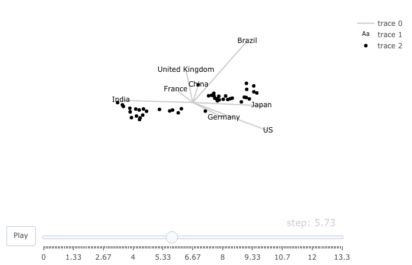

```{r setup, include=FALSE}
knitr::opts_chunk$set(warning = FALSE, message = FALSE, echo = FALSE)
```


```{r, warning = FALSE, include = FALSE}

library(ggraph)
library(igraph)
library(visNetwork)
library(plotly)
library(gapminder)
library(seriation)

```

# Statement of contribution

We have done most parts together, but Yifan mainly contributed to assignment 1. Hugo mainly contributed to assignment 2.

# Assignment 1
### Assignment 1.1 


```{r, warning=FALSE, echo=FALSE, message=FALSE}

nodes <- read.table("trainMeta.dat",sep = " ",header = FALSE)

nodes$id <- 1:70
nodes$label <- as.character(nodes$V1)
nodes$title <- as.character(nodes$V1)
nodes$group <- as.character(nodes$V2)
nodes <- nodes[,3:6]


edges <- read.table("trainData.dat", 
                    header=FALSE)
colnames(edges) <- c("from", "to", "Value")

graph <- graph_from_data_frame(d=edges, vertices=nodes, directed=T)
nodes$value <- strength(graph)
network_1 <- visNetwork(nodes, edges)%>% 
  visPhysics(solver='repulsion')%>% 
  visOptions(highlightNearest =   list(enabled = TRUE, degree = 1,
                                       labelOnly = FALSE, hover = TRUE),
                                             nodesIdSelection = TRUE)

network_1


```

The graph above shows that Jamal Zougam  and Mohamed Chaoui seem to be the center of the network. The first and biggest cluster are around Imad Eddin Barakat. We can also see the group which include people that are involved in the bombing and didn't participate in any camp before which can be obtained of not seeing any thicker lines between them.

When can also see a small cluster in the top containing spanish names, where Ivan Granados seems to be the center of the cluster

We can see that Jamal Zougam and Mohamed Chaoui seems to have the connetion to same people. The bombers seems to be more inte the center of the network than those that didn't were a bomber.


### Assignment 1.2

```{r, warning=FALSE, echo=FALSE}
network_2 <- network_1 %>% visOptions(highlightNearest = list(enabled = TRUE, degree = 2,
                                                              labelOnly = FALSE, hover = TRUE),
                        nodesIdSelection = TRUE)

network_2
```
Vinay Kholy is a person with a really big node which is connencted to every bomber with just one step. The same is with Suresh Kumar who also has a very big node. Suresh Kumar and Vinay Kohly are almost connencted to everyone in the network and they are charged with providing the mobile telephones used in the bombings according to google. 

### Assignment 1.3


```{r, warning=FALSE, echo=FALSE}

nodes_new <- nodes
graph_new <- graph_from_data_frame(d=edges, 
                                 vertices = nodes_new, 
                                 directed = FALSE)
nodes_new$group <- cluster_edge_betweenness(graph_new)$membership
network_3 <- visNetwork(nodes_new, edges)%>% 
  visPhysics(solver='repulsion') %>% 
  visOptions(highlightNearest = list(enabled = TRUE, degree = 1,
                                     labelOnly = FALSE, hover = TRUE),
             nodesIdSelection = TRUE)

network_3

```

The plot above shows the network when we have compute clusters by optimizing edge betweenness. The small cluster with the spanish names are also a cluster here. The big cluster with Imad Eddin Barakat are also a cluster here. This network shows way more cluster than we found in assignment 2.

### Assignment 1.4

```{r, warning=FALSE, echo=FALSE}
nodes1<-nodes
net <- graph_from_data_frame(d=edges, vertices=nodes1, directed=F)
netm <- get.adjacency(net, attr="Value", sparse=F)
colnames(netm) <- V(net)$label
rownames(netm) <- V(net)$label
rowdist<-dist(netm)
library(seriation)
order1<-seriate(rowdist, "HC")
ord1<-get_order(order1)
reordmatr<-netm[ord1,ord1]
network_4 <- plot_ly(z=~reordmatr, x=~colnames(reordmatr), 
        y=~rownames(reordmatr), type="heatmap")
network_4


```
The graph shows that the it seems to be a cluster is the one in the top right of the graph. The cluster seems to be of person that have done bombings or trained together. This cluster contains the same person that the big cluster in the earliers assignments.


# Assignment 2
### Assignment 2.1

```{r}

library(plotly)
library(gapminder)

df <- read.csv2('Oilcoal.csv')[,c(1:5)]

fig <- df %>%
  plot_ly(
    x = ~Coal, 
    y = ~Oil, 
    size = ~Marker.size, 
    color = ~Country, 
    frame = ~Year, 
    text = ~Country, 
    hoverinfo = "text",
    type = 'scatter',
    mode = 'markers'
  )
fig

```

**Answer:** From above bubble chart, we found following features: 

* 1.China increased Oil usage drastically from 0 to 400 during this period.

* 2.China, Brazil and India all almost have no Oil usage before 1965.

* 3.Germany, UK, France decreased the usage of Coal.

* 4.US consume the largest amount of Oil and Coal all the time from 1965 to 2009.


### Assignment 2.2
```{r}


fig2 <- df%>%filter(Country %in% c("Brazil", "India"))%>%
  plot_ly(
    x = ~Coal, 
    y = ~Oil, 
    size = ~Marker.size, 
    color = ~Country, 
    frame = ~Year, 
    text = ~Country, 
    hoverinfo = "text",
    type = 'scatter',
    mode = 'markers'
  )

fig2
 
```

**Answer:** We find Brazil and India have the same motion pattern. India and Brazil both started their Oil industry in 1960s, which could refer to Wikipedia, [Oil and gas industry in India](https://en.wikipedia.org/wiki/Oil_and_gas_industry_in_India) and [Energy in Brazil](https://en.wikipedia.org/wiki/Energy_in_Brazil). Since they both start to use Oil from 1960s, it is possible that Brazil and India might have some similar purpose to consume or produce Oil, this might explain that why they have similar motion pattern from above chart.


### Assignment 2.3

```{r, message=FALSE}


df1 <-df
df2 <-df

df1$Oilp <- 100 * df$Oil / (df$Oil + df$Coal)
df2$Oilp  <- 0

df3 <- rbind(df1,df2)

countries_list <- c('Brazil', "US", "Germany", "United Kingdom", "France", "India", "Japan", "China")

fig3 <- df3%>%filter(Country == countries_list[1])%>%plot_ly(
    x = ~Oilp, 
    y = ~Country, 
    name = countries_list[1],
    frame = ~Year, 
    type = 'scatter',
    mode = 'line',
    line = list( width = 20)
  )
  

for(i in c(2:8)){
  
fig3 <- fig3%>%add_trace(data = df3%>%filter(Country == countries_list[i]),
                 x = ~Oilp,
                 y = ~Country,
                 name = countries_list[i],
                 line = list(width = 20))

}

fig3%>%animation_opts(100,redraw = F)
```

**Answer:** 

* Advantages: It is clear to find the proportion changing of Oil in each country, which could reveal the energy consumption structure. We can find following interesting information: China, France, Germany, India, and UK all increased the ratio of Oil Consumption, but US and Brazil almost keep the same energy consumption structure, whereas Japan decreased the ratio of Oil consumption.

* Disadvantages: We could only compare the the Oil consumption proportion among those countries, but this animated bar chart can't reveal the real consumption of Oil. We can find from bubble chart that China is the second largest country in consuming Oil, but in the bar chart, China has the lowest Oil consumption ratio.


### Assignment 2.4

```{r , message=FALSE}


fig3%>%animation_opts(100, easing = "elastic", redraw = F)

```

**Answer:**

* Advantage: Unlike previous linear easing, this Elastic easing function make the animation more vivid, as  [easeInElastic](https://easings.net/#easeInElastic) described, `Objects in real life don’t just start and stop instantly, and almost never move at a constant speed. `, elastic easing could catch more attention from people who watch it.

* Disadvantage: Elastic easing make the animation a little flashing, human could be tired by watching it.


### Assignment 2.5

```{r , message=FALSE}

library(tourr)
library(plotly)

df_new <- data.frame(Year=c(1965:2009))
rownames(df_new) <- df_new$Year

for (i in countries_list) {
  df_new[i] <-df%>%filter(Country==i)%>%select(Coal)
}

df_new <- df_new[, -1]

mat <- rescale(df_new)
set.seed(12345)
tour <- new_tour(mat, grand_tour(), NULL)
#tour<- new_tour(mat, guided_tour(cmass), NULL)

steps <- c(0, rep(1/15, 200))
Projs<-lapply(steps, function(step_size){  
  step <- tour(step_size)
  if(is.null(step)) {
    .GlobalEnv$tour<- new_tour(mat, guided_tour(cmass), NULL)
    step <- tour(step_size)
  }
  step
}
)

# projection of each observation
tour_dat <- function(i) {
  step <- Projs[[i]]
  proj <- center(mat %*% step$proj)
  data.frame(x = proj[,1], y = proj[,2], state = rownames(mat))
}

# projection of each variable's axis
proj_dat <- function(i) {
  step <- Projs[[i]]
  data.frame(
    x = step$proj[,1], y = step$proj[,2], variable = colnames(mat)
  )
}

stepz <- cumsum(steps)

# tidy version of tour data

tour_dats <- lapply(1:length(steps), tour_dat)
tour_datz <- Map(function(x, y) cbind(x, step = y), tour_dats, stepz)
tour_dat <- dplyr::bind_rows(tour_datz)

# tidy version of tour projection data
proj_dats <- lapply(1:length(steps), proj_dat)
proj_datz <- Map(function(x, y) cbind(x, step = y), proj_dats, stepz)
proj_dat <- dplyr::bind_rows(proj_datz)

ax <- list(
  title = "", showticklabels = FALSE,
  zeroline = FALSE, showgrid = FALSE,
  range = c(-1.1, 1.1)
)

# for nicely formatted slider labels
options(digits = 3)
tour_dat <- highlight_key(tour_dat, ~state, group = "A")
tour <- proj_dat %>%
  plot_ly(x = ~x, y = ~y, frame = ~step, color = I("black")) %>%
  add_segments(xend = 0, yend = 0, color = I("gray80")) %>%
  add_text(text = ~variable) %>%
  add_markers(data = tour_dat, text = ~state, ids = ~state, hoverinfo = "text") %>%
  layout(xaxis = ax, yaxis = ax)#%>%animation_opts(frame=0, transition=0, redraw = F)
tour

```



```{r}
coal_year<-df1%>%filter(Country == "US")%>%
  plot_ly(x=~Year, y=~Coal,type = 'scatter',name = 'US',
    mode = 'line')

coal_year<-coal_year%>%add_trace(data = df1%>%filter(Country == "Brazil"),
                 x = ~Year,
                 y = ~Coal,
                 name = "Brazil")

coal_year<-coal_year%>%add_trace(data = df1%>%filter(Country == "India"),
                 x = ~Year,
                 y = ~Coal,
                 name = "India")
coal_year
```


**Answer:** We find above frame project the most seperated clusters, 4 clusters could be find from this frame, those clusters contain point from 1965 to 1977, 1979 to 1983, 1984 to 1999, 2000 to 2008, and seems 2009 is a outlier from those clusters which do belong to any clusters. We plot a time series on Coal for 3 longest axes countries, US, Brazil, and India. From the time series plot, it seems the slops of the curve have some correspondances with those clusters, from 1965 to 1977, the slop of all 3 countries are very low, then getting bigger, the slope changing might lead to new clusters, 2009 is a outlier which do not belong to any clusters, might because the Coal consumption of US suddenly decreased in 2009.

# Appendix

## Assignment 1

```
nodes <- read.table("trainMeta.dat",sep = " ",header = FALSE)

nodes$id <- 1:70
nodes$label <- as.character(nodes$V1)
nodes$title <- as.character(nodes$V1)
nodes$group <- as.character(nodes$V2)
nodes <- nodes[,3:6]


edges <- read.table("trainData.dat", 
                    header=FALSE)
colnames(edges) <- c("from", "to", "Value")

graph <- graph_from_data_frame(d=edges, vertices=nodes, directed=T)
nodes$value <- strength(graph)
network_1 <- visNetwork(nodes, edges)%>% 
  visPhysics(solver='repulsion')%>% 
  visOptions(highlightNearest =   list(enabled = TRUE, degree = 1,
                                       labelOnly = FALSE, hover = TRUE),
                                             nodesIdSelection = TRUE)

network_1

network_2 <- network_1 %>% visOptions(highlightNearest = list(enabled = TRUE, degree = 2,
                                                              labelOnly = FALSE, hover = TRUE),
                        nodesIdSelection = TRUE)

network_2

nodes_new <- nodes
graph_new <- graph_from_data_frame(d=edges, 
                                 vertices = nodes_new, 
                                 directed = FALSE)
nodes_new$group <- cluster_edge_betweenness(graph_new)$membership
network_3 <- visNetwork(nodes_new, edges)%>% 
  visPhysics(solver='repulsion') %>% 
  visOptions(highlightNearest = list(enabled = TRUE, degree = 1,
                                     labelOnly = FALSE, hover = TRUE),
             nodesIdSelection = TRUE)

network_3
nodes1<-nodes
net <- graph_from_data_frame(d=edges, vertices=nodes1, directed=F)
netm <- get.adjacency(net, attr="Value", sparse=F)
colnames(netm) <- V(net)$label
rownames(netm) <- V(net)$label
rowdist<-dist(netm)
library(seriation)
order1<-seriate(rowdist, "HC")
ord1<-get_order(order1)
reordmatr<-netm[ord1,ord1]
network_4 <- plot_ly(z=~reordmatr, x=~colnames(reordmatr), 
        y=~rownames(reordmatr), type="heatmap")
network_4


```

## Assignment 2

```
library(plotly)
library(gapminder)

df <- read.csv2('Oilcoal.csv')[,c(1:5)]

fig <- df %>%
  plot_ly(
    x = ~Coal, 
    y = ~Oil, 
    size = ~Marker.size, 
    color = ~Country, 
    frame = ~Year, 
    text = ~Country, 
    hoverinfo = "text",
    type = 'scatter',
    mode = 'markers'
  )
fig

fig2 <- df%>%filter(Country %in% c("Brazil", "India"))%>%
  plot_ly(
    x = ~Coal, 
    y = ~Oil, 
    size = ~Marker.size, 
    color = ~Country, 
    frame = ~Year, 
    text = ~Country, 
    hoverinfo = "text",
    type = 'scatter',
    mode = 'markers'
  )

fig2

df1 <-df
df2 <-df

df1$Oilp <- 100 * df$Oil / (df$Oil + df$Coal)
df2$Oilp  <- 0

df3 <- rbind(df1,df2)

countries_list <- c('Brazil', "US", "Germany", "United Kingdom", "France", "India", "Japan", "China")

fig3 <- df3%>%filter(Country == countries_list[1])%>%plot_ly(
    x = ~Oilp, 
    y = ~Country, 
    name = countries_list[1],
    frame = ~Year, 
    type = 'scatter',
    mode = 'line',
    line = list( width = 20)
  )
  

for(i in c(2:8)){
  
fig3 <- fig3%>%add_trace(data = df3%>%filter(Country == countries_list[i]),
                 x = ~Oilp,
                 y = ~Country,
                 name = countries_list[i],
                 line = list(width = 20))

}

fig3%>%animation_opts(100,redraw = F)

fig3%>%animation_opts(100, easing = "elastic", redraw = F)

library(tourr)
library(plotly)

df_new <- data.frame(Year=c(1965:2009))
rownames(df_new) <- df_new$Year

for (i in countries_list) {
  df_new[i] <-df%>%filter(Country==i)%>%select(Coal)
}

df_new <- df_new[, -1]

mat <- rescale(df_new)
set.seed(12345)
tour <- new_tour(mat, grand_tour(), NULL)
#tour<- new_tour(mat, guided_tour(cmass), NULL)

steps <- c(0, rep(1/15, 200))
Projs<-lapply(steps, function(step_size){  
  step <- tour(step_size)
  if(is.null(step)) {
    .GlobalEnv$tour<- new_tour(mat, guided_tour(cmass), NULL)
    step <- tour(step_size)
  }
  step
}
)

# projection of each observation
tour_dat <- function(i) {
  step <- Projs[[i]]
  proj <- center(mat %*% step$proj)
  data.frame(x = proj[,1], y = proj[,2], state = rownames(mat))
}

# projection of each variable's axis
proj_dat <- function(i) {
  step <- Projs[[i]]
  data.frame(
    x = step$proj[,1], y = step$proj[,2], variable = colnames(mat)
  )
}

stepz <- cumsum(steps)

# tidy version of tour data

tour_dats <- lapply(1:length(steps), tour_dat)
tour_datz <- Map(function(x, y) cbind(x, step = y), tour_dats, stepz)
tour_dat <- dplyr::bind_rows(tour_datz)

# tidy version of tour projection data
proj_dats <- lapply(1:length(steps), proj_dat)
proj_datz <- Map(function(x, y) cbind(x, step = y), proj_dats, stepz)
proj_dat <- dplyr::bind_rows(proj_datz)

ax <- list(
  title = "", showticklabels = FALSE,
  zeroline = FALSE, showgrid = FALSE,
  range = c(-1.1, 1.1)
)

# for nicely formatted slider labels
options(digits = 3)
tour_dat <- highlight_key(tour_dat, ~state, group = "A")
tour <- proj_dat %>%
  plot_ly(x = ~x, y = ~y, frame = ~step, color = I("black")) %>%
  add_segments(xend = 0, yend = 0, color = I("gray80")) %>%
  add_text(text = ~variable) %>%
  add_markers(data = tour_dat, text = ~state, ids = ~state, hoverinfo = "text") %>%
  layout(xaxis = ax, yaxis = ax)#%>%animation_opts(frame=0, transition=0, redraw = F)
tour


```
